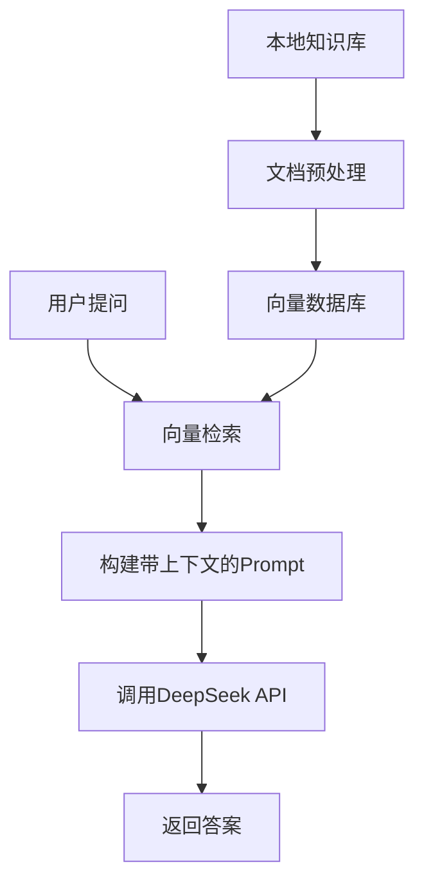

## 系统设计

要结合 DeepSeek 远程 API 和 本地知识库，核心思路是：<br/>
**将本地知识库中的内容转换为可检索的上下文，动态插入到 API 请求的 `prompt` 中**，让远程模型基于本地知识生成回答。以下是完整方案：


*实现方案*

## 连接DeepSeek服务

### 环境准备

创建虚拟环境：
```shell
# 使用 python的 venv 工具
python -m venv deepseek-env            # 创建
source deepseek-env/bin/activate       # Linux/Mac  激活虚拟环境
# source deepseek-env/Script/activate  # Windows
deactivate  # 退出虚拟环境

# 使用 conda，如
conda create -n deepseek-env python=3.10
conda activate deepseek-env # 激活虚拟环境
# source activate deepseek-env
conda deactivate  # 退出
```

安装基础依赖：
```shell
# pip install torch # PyTorch安装命令参考其官网 与 CUDA版本
pip install python-dotenv>=1.0.1
pip install openai
```

### 模型API key获取

<a href="https://wwww.deepseek.com" target="_blank">DeepSeek官网</a> 获取API keys。

### 通过API key访问DeepSeek

<a href="https://api-docs.deepseek.com/zh-cn/" target="_blank">DeepSeek API文档</a>，**首次调用 API** 之python。

## LangChain 集成知识库

### 安装库

安装Python库：
```shell
# LangChain
pip install langchain
pip install langchain_community
pip install langchain-chroma
pip install langchain-huggingface

pip install unstructured[all-docs]
pip install sentence-transformers
pip install chromadb

pip install posthog>=2.4.0
pip install httpx[socks]

pip install accelerate>=0.26.0
```

安装tesseract：
```shell
# 命令行工具
sudo apt install tesseract-ocr
# 语言
sudo apt install tesseract-ocr-eng
sudo apt install tesseract-ocr-chi-sim
```

### 文档处理流程

加载本地文档
```python
from langchain_community.document_loaders import DirectoryLoader

loader = DirectoryLoader(path="docs", glob="**/*" )  # glob="**/*.txt" "**/*.pdf"
documents = loader.load()
```
文档分块
```python
from langchain_text_splitters import RecursiveCharacterTextSplitter

text_splitter = RecursiveCharacterTextSplitter(chunk_size=500, chunk_overlap=50)
texts = text_splitter.split_documents(documents)
```

### 向量存储

```python
from langchain_huggingface import HuggingFaceEmbeddings

embeddings = HuggingFaceEmbeddings(
        model_name="BAAI/bge-small-zh-v1.5",
        model_kwargs={'device': 'cuda'}
)
# 向量数据库会自动保存到 persist_directory
chroma = Chroma.from_documents(texts, embedding=embeddings, persist_directory='.vector_db/chroma_db')
```

### 向量检索

```python
query = '要问的问题，该问题和向量数据库内容相关。'
docs = chroma.similarity_search(query=query, k=3)
for doc in docs:
    print(doc.page_content)
```
构建提示词，context 是向量数据库检索结果，query 是用户问题：
```python
def build_prompt(context, query):
    # 构建系统提示词，包含本地知识
    system_prompt = f"""
    你是一个智能助手，请基于以下知识库内容回答问题：
    {context}

    用户问题：
    {query}

    如果无法从知识库中找到答案，请明确告知用户。
    """
    return system_prompt
````

### DeepSeek API集成

```python
from openai import OpenAI

client = OpenAI(api_key='你申请的DeepSeek API key', base_url="https://api.deepseek.com")


def chat(client, query):
    response = client.chat.completions.create(
        model=self.model,
        messages=[
            {"role": "system", "content": "You are a helpful assistant"},
            {"role": "user", "content": query},
        ],
        n=None,
        stream=False, # 可以将 stream 设置为 true 来使用流式输出
    )
    return response

response = chat(client, '你的问题？')
print(response.choices[0].message.content)  # 输出结果
```


## 实现Web交互界面

关于Web界面，这里采用 `Open WebUI`，并自己实现 `openai`格式的后端。

### 后端实现

安装库：
```shell
pip install flask
```

这里 `flask` 实现后端为例。
```python
from flask import Flask, request, render_template, jsonify

app = Flask(__name__)

@app.route('/v1/models', methods=['GET'])
def list_models():
    return jsonify({
        "data": [
            {
                "id": "deepseek-chat",
                "object": "model",
                "created": 1686935000
            },
        ]
    })

# @app.route('/ask', methods=['POST'])
@app.route('/v1/chat/completions', methods=['POST'])
def chat():
    data = request.json
    model_name = data.get("model")  # 获取模型名称

    messages = data.get('messages', [])
    query_new = next((m['content'] for m in reversed(messages) if m['role'] == 'user'), "")  # 获取最新的问题
    query = str(messages)


    result = ''
    if assistant.is_qa is False:
        result = assistant.chat(query)  # 使用远程LLM 提供的 API
    else:
        result = assistant.chat(query, query_new)  # 本地知识库 + 远程LLM 提供的 API

    # 构造OpenAI格式响应
    return jsonify({
            "id": "chatcmpl-" + str(int(time.time())),
            "object": "chat.completion",
            "created": int(time.time()),
            "model": "deepseek-7b",
            "choices": [{
                "index": 0,
                "message": {
                    "role": "assistant",
                    "content": result
                },
                "finish_reason": "stop"
            }],
        })

if __name__ == '__main__':
    assistant  # 为封装了OpenAI 和 本地知识库 的类对象，chat方法，可以根据前面的chat函数实现
    app.run(host='0.0.0.0', port=5000, debug=True)
```

大体上的代码都有了，有报错的地方可以自己改改哈hhh，不想粘代码了hhh。

### Open WebUI前端界面

<a href="https://github.com/open-webui/open-webui" target="_blank">Open WebUI</a>。

创建虚拟环境，并激活。

pip安装
```shell
pip install open-webui
```

部署完成后，执行命令 `open-webui serve` 启动。

浏览器打开Open WebUI：`http://localhost:8080`。

打开管理员设置：
- 方法1：右上角头像，管理员面板，设置，外部连接。
- 方法2：右上角头像，设置，管理员设置，外部连接。
- 方法3：左下角头像，其余步骤参考 方法1 和 方法2。

`管理OpenAI API连接`，修改为自己后端地址 `http://localhost:5000/v1`， API 密钥填`NONE`。

点击右下角`保存`按钮。

