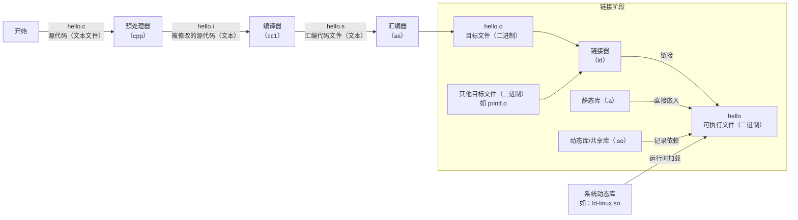

## GCC简介

`GNU` 是 `GNU's Not Unix!`的递归缩写。<br/>
`GNU`是一个技术组织。GNU计划，又称革奴计划，目标是创建一套完全自由的软件操作系统。

**`GCC`** 是由GNU开发的**能够编译多种编程语言**的编译器。
- 最初，GCC是指`GNU C Compiler`（GNU C语言编译器），只能处理C语言。
- 随着时间发展，GCC 项目扩展了功能，开始支持多种编程语言（C++, Objective-C, Fortran, Ada, Go, D 等）。因此，**GCC 现在的官方含义是** "`GNU Compiler Collection`" (GNU 编译器套件)。它是一个包含多种语言编译器的集合。

## gcc常用参数

| 选项 | 说明 |
|:----:|:----:|
| -v/--version | 查看gcc的版本 |
| -I（大写的i） | 编译的时候指定头文件路径，不然头文件找不到 |
| -c | 将汇编文件转换成二进制文件，得到.o文件 |
| -g | gdb调试的时候需要加 |
| -D | 编译的时候指定一个宏（调试代码的时候需要使用例如printf函数，<br/>但是这种函数太多了对程序性能有影响，因此如果没有宏，则#ifdefine的内容不起作用）|
| -wall | 添加警告信息 |
| -On | -O是优化代码，n是优化级别：1，2，3 |

## gcc工作流程

gcc工作流程，即编译汇编的四个阶段：预处理（预编译）、编译、汇编和链接。

1. 预处理（-E）
```shell
gcc -E test.c -o test.i
```
执行预处理，由源代码test.c 生成 test.i 源文件/`中间文件`。
2. 编译（-S）
```shell
gcc -S test.i -o test.s
```
由 test.i临时文件 生成 test.s `汇编文件`。
```shell
gcc -S test.c
```
执行预处理和编译，输出 test.s 汇编文件。
3. 汇编（-c）
```shell
gcc -c test.s -o test.o
```
由 test.s 汇编文件 生成 test.o 二进制`目标文件`。
```shell
gcc -c test.i -o test.o
```
执行 编译、汇编。
```shell
gcc -c test.c
```
执行 预处理、编译、汇编。
4. 链接
```shell
gcc test.o -o test
```
将目标文件（.o）链接到一起生成`可执行程序（可执行文件）`，静态库文件（.a）直接嵌入可执行程序，对于动态库（.so）可执行程序中记录依赖关系。

- 核心动作是 "链接目标文件(.o)生成可执行程序"
- 静态库和动态库的处理是 对可执行程序的修饰操作
  - 静态库 `.a` 本质是目标文件的集合（`ar`打包的多个`.o`），其代码被复制到可执行文件内部
  - 动态库 `.so` 只会在可执行文件中记录库名和符号引用（通过 `ldd` 可查看）




## 静态库 和 动态库

### 简介

库是二进制文件，.o文件，由源代码经过 预处理、编译、汇编 生成。

### 静态库

Linux下，静态库（Static Library），扩展名为`.a`。

#### 制作静态库

准备源代码，下面已foo.c文件为例。

```c
// foo.c

#include<stdio.h>

void foo(void)
{
    printf("Here is a static library\n");
}
```
将 foo.c 编译成静态库 libfoo.a：
```shell
gcc -c foo.c  # 生成 foo.o 目标文件

ar rcs libfoo.a foo.o  # ar打包.o文件（可以是多个），生成 libfoo.a 静态库
```

#### 使用静态库

示例，test.c 文件，调用 foo函数：
```c
// test.c
#include<stdio.h>

void foo(void);

int main(void)
{
    printf("Hello,this is a test!\n");
    foo();
    return 0;
}
```

编译 test.c 并链接到静态库 libfoo.a：
```shell
# 方法1
gcc test.c -static libfoo.a -o test

# 方法2，-L 指定库的搜索路径，. 或 ./ 表示当我目录；-l指定库名（掐头去尾）
gcc test.c -static -L./ -lfoo -o test
```
`-static`选项可以省略。

### 动态库

Linux下，动态库（Dynamic Library）又称共享库（Shared Library），扩展名为`.so`。

#### 制作共享库

准备源代码，下面创建一个fuu.c文件，进行演示，内容如下：
```c
// fuu.c

#include<stdio.h>

void fuu(void)
{
    printf("Here is a shared library\n");
}
```
将其编译为动态库/共享库（由于动态库可以被多个进程共享加载，所以需要使用 `-fPIC` 选项生成位置无关的代码。
```shell
# 方法1
gcc fuu.c -shared -fPIC -o libfuu.so
# 方法2
gcc fuu.c -c -fPIC
gcc -shared fuu.o -o libfuu.so
```

#### 使用共享库

示例文件 test.c，调用 fuu函数：
```c
// test.c
#include<stdio.h>

void fuu(void);

int main(void)
{
    printf("Hello,this is a test!\n");
    fuu();
    return 0;
}
```

编译 test.c 并链接共享库 libfuu.so：
```shell
# 方法1 动态库在当前目录
gcc test.c libfuu.so -o test

# 方法2 -L 选项指定库的路径，.表示当前目录；-l指定动态库名称
gcc test.c -L. -lfuu -o test
```

> 但是此时运行 test 程序失败<br/>
原因是找不到 libfuu.so 共享库<br/>
这是因为 libfuu.so 并不在 Linux 系统的默认搜索目录中，解决办法是我们主动告诉系统，libfuu.so 共享库在哪里。

1. 方式一：设置环境变量`LD_LIBRARY_PATH`
```shell
# 示例：
export LD_LIBRARY_PATH=$(pwd)
export LD_LIBRARY_PATH=$LD_LIBRARY_PATH:$(pwd)
```
将 libfuu.so 所在的当前目录添加到 LD_LIBRARY_PATH 变量，再次执行 test。
2. 方式二：使用 `rpath` 将共享库位置嵌入到程序
```shell
gcc test.c -L. -lfuu -Wl,-rpath=`pwd` -o test
```
rpath 即 run path，是种可以将共享库位置嵌入程序中的方法，从而不用依赖于默认位置和环境变量。<br/>
这里在链接时使用 -Wl,-rpath=/path/to/yours 选项，-Wl 会发送以逗号分隔的选项到链接器，注意逗号分隔符后面没有空格哦。
3. 方式三：将 libfuu.so 共享库添加到系统路径 `/usr/lib/`
```shell
sudo cp libfuu.so /usr/lib/
```
执行程序 ./test 。


经过以上步骤，如果 test 程序仍然运行失败：
- 请尝试执行 `ldconfig` 命令更新共享库的缓存列表。
- 此时，再次查看 test 程序的共享库依赖
```shell
ldd test
```
可以看到 libfuu.so 已经被发现了，其中 /lib 是 /usr/lib 目录的软链接。

## gcc 和 g++

编译`C++`代码，我们通常使用g++编译器。实际上也可以使用 gcc。

一次完成 预处理、编译、汇编、链接：
```shell
gcc -o main main.cpp -lstdc++  # 链接时使用 C++标准库
gcc -o main main.cpp -lstdc++ -std=c++11  # 指定C++版本，如c++11
```

分步完成：
```shell
gcc -o main.ii -E main.cpp   # 预处理
gcc -o main.s -S main.ii     # 编译
gcc -o main.o -c main.s      # 汇编
gcc -o main main.o -lstdc++             # 链接
gcc -o main main.o -lstdc++ -std=c++11  # 链接 指定C++版本
```

`g++`只是将gcc默认语言设为C++的一个特殊版本。

