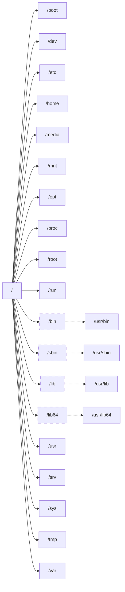

## Linux的目录结构

Linux操作系统使用`单一目录树`结构，整个操纵系统只有一个`根目录`。根目录用`正斜线`（/）表示，目录之间也是通过正斜线分隔（如：/etc/systemd/）。

各个分区分别被挂载到目录树的某个目录中，通过通过访问挂载点目录，即可实现对这些分区的访问。

> 在Linux系统中，根目录是文件系统的最顶层，是所有其他目录和文件的起点，所有的目录、文件和设备都在根目录之下。
{: .prompt-info }

## 根目录 及 系统目录

- **`/`**：根目录，linux文件系统的最顶端。
- **`/boot`**：Boot Directory，存放用于系统启动的内核文件 和 引导装载程序文件。
- **`/dev`**：设备文件目录（Device Directory）；存放设备文件。
- **`/etc`**：配置文件目录（Etcetera Directory）；存放系统配置文件，如网络配置、设备配置文件等。
- **`/home`**：普通用户家目录（Home Directory）；存放各个用户的主目录；其中的子目录是每个用户的主目录（家目录），名称为各用户的用户名。
- **`/media`**：可移动媒体设备（Media Directory）；用于挂载可移动设备的临时目录；U盘、光盘、软盘等设备的默认挂载点。
- **`/mnt`**：挂载目录（Mount Directory）；为某些设备提供的默认挂载点。
- **`/opt`**：可选的附加应用程序安装目录（Optional Directory）。
- **`/proc`**：进程信息及内核信息目录（Process Directory）；系统自动产生的映射，查看该目录中的文件可获取有关系统硬件运行的信息。
- **`/root`**：root用户主目录（Root User's Home Directory）。
- **`/run`**：运行时数据目录（Run-time Directory）；包含运行时文件和进程间通信文件‌。
- **`/bin`**：所有用户的二进制命令目录（Binary Directory）；  
是/usr/bin/目录的软链接；存放用于系统管理和维护的常用、实用命令文件。
- **`/sbin`**：系统管理的二进制命令目录（System Binary Directory）；  
是/usr/sbin/目录的软链接；存放系统管理员或root用户使用的二进制命令文件。
- **`/lib`**：库目录（Library Directory）；是/usr/lib/目录的软链接；存放动态链接共享库（.so文件，对应Windows系统的.dll文件）。
- **`/lib64`**：是/usr/lib64/目录的软链接。
- **`/usr`**：Unix操作系统软件资源目录（Unix Software Resource Directory，User Software Resource Directory）；  
存放应用程序和文件；所有系统默认的软件都会放置到/usr底下，包含二进制文件、库文件、文档和二级程序的源代码。
- **`/srv`**：服务数据目录（Service Directory）。
- **`/sys`**：sysfs；一个虚拟文件系统（Virtual File System），它提供了一个接口，用于访问和修改内核的设备和驱动程序的状态。这个目录的内容是由内核在运行时动态生成的，反映了系统的硬件状态和内核的配置。
- **`/tmp`**：临时文件目录（Temporary Directory）。
- **`/var`**：变量文件目录（Variable Directory）；保存经常变化的内容，如系统日志。

## Linux的路径

Linux路径（目录之间）通过`正斜线`（/）分隔，如：/var/log/。
**绝对路径**：由`根目录`开始的文件名或目录名，例如**/etc/profile**。
**相对路径**：开头不是根目录的路径，例如**../../home/user1/**。

## Linux的特殊目录

| 目录 | 说明 |
|:---:|:----:|
| /       | 根目录 |
| .       | 当前目录 |
| ..      | 当前目录的上一级目录 |
| ~       | 当前用户的主目录 |
| ~用户名 | 特定用户的主目录；ls ~jyu |
| -       | 上一次的工作目录；cd - |

## 日志目录

[在Linux中，日志文件通常存储在哪些目录？](https://www.cnblogs.com/huangjiabobk/p/18172420)
* /var
   1. **/var/log/**
   2. **/var/spool/**
* **/proc/sys/log/**
* /home/ 或 /opt/ 或 其他用户目录
  - 对于特定于用户或特定于应用程序的日志，它们可能会被存储在这些目录下。
* **/etc/**
  - 虽然`/etc/`目录主要用于存放系统配置文件，但某些日志，也可能存放在这里。这些文件通常也被视为系统日志的一部分，因此它们通常也会在`/var/log/`下有一个符号链接或备份。

